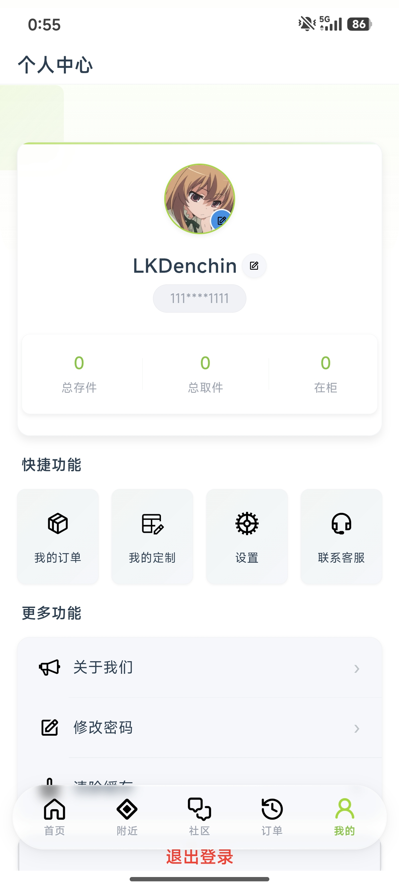
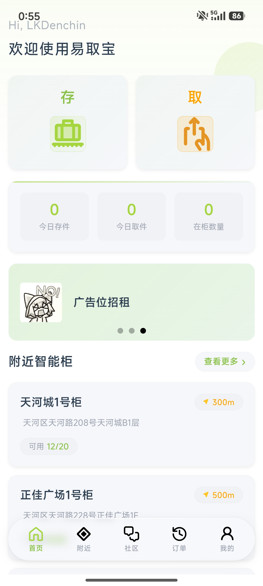
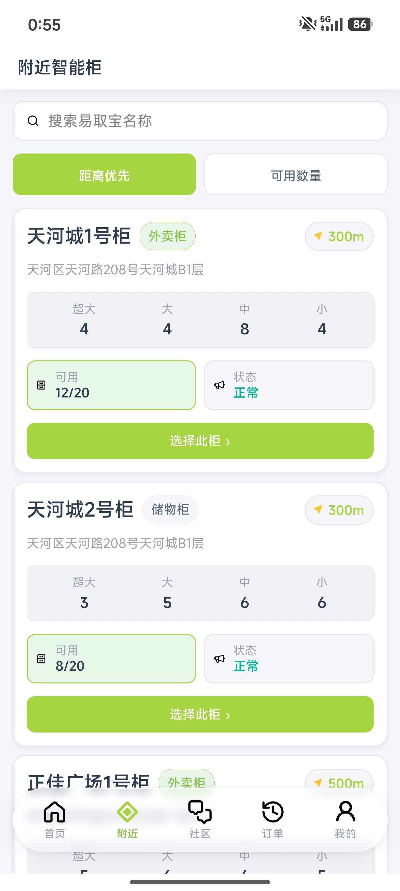
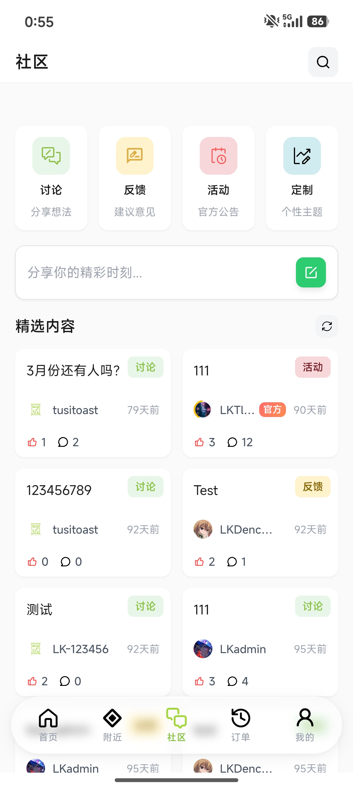
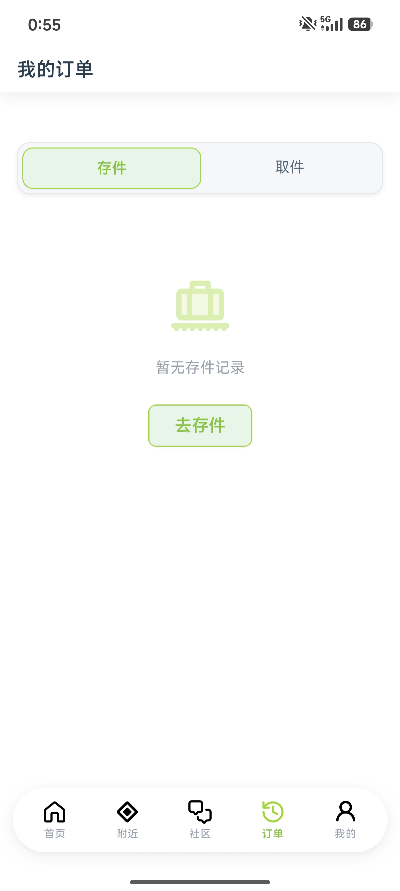

# 易取宝 - 智能柜管理系统

[English](README_EN.md) | 中文

一款基于物联网的智能柜存取系统，支持 NFC 感应取件、光电传感器防盗检测、社区互动和后台管理。

## 应用截图

<table>
  <tr>
    <td align="center"><b>移动端 - 首页</b></td>
    <td align="center"><b>移动端 - 柜子详情</b></td>
    <td align="center"><b>移动端 - 取件</b></td>
  </tr>
  <tr>
    <td></td>
    <td></td>
    <td></td>
  </tr>
  <tr>
    <td align="center"><b>管理后台 - 数据看板</b></td>
    <td align="center"><b>管理后台 - 柜子管理</b></td>
    <td></td>
  </tr>
  <tr>
    <td></td>
    <td></td>
    <td></td>
  </tr>
</table>

## 系统架构

```
┌─────────────────────────────┐
│      移动端 (UniApp)         │  用户存取物品、查看柜子、社区互动
└─────────────────────────────┘
            │ HTTP/REST API
            ▼
┌─────────────────────────────┐
│      后端服务 (Express)       │  认证、订单、柜子状态、防盗告警
│      端口: 1145              │
└─────────────────────────────┘
     │                │
     ▼                │ HTTP 轮询
┌──────────┐          ▼
│  MySQL   │   ┌──────────────────┐
│  数据库   │   │  ESP32 智能柜终端  │
└──────────┘   │  - 光电传感器      │
               │  - NFC 写入器      │
               └──────────────────┘

┌─────────────────────────────┐
│    管理后台 (Vue 3)           │  数据看板、用户/订单/告警管理
└─────────────────────────────┘
```

## 技术栈

| 模块 | 技术 | 说明 |
|------|------|------|
| 后端服务 | Node.js + Express | REST API 服务 |
| 数据库 | MySQL / MariaDB | 数据持久化 |
| 认证 | JWT | 无状态令牌认证 |
| 管理后台 | Vue 3 + Vite + Element Plus | 管理仪表盘 |
| 数据可视化 | ECharts | 统计图表 |
| 移动端 | UniApp (Vue 3) | 用户端 App |
| 硬件终端 | ESP32-C3 | IoT 控制器 |
| 传感器 | 光电传感器 + PN532 NFC | 物品检测与 NFC 写入 |

## 项目结构

```
├── database/               # 后端 API 服务
│   ├── server.js           # Express REST API
│   ├── database.js         # MySQL 初始化与连接池
│   └── package.json        # 依赖配置
│
├── Management-System/      # 管理后台前端
│   ├── src/
│   │   ├── views/          # 页面组件 (Dashboard, Users, Orders...)
│   │   ├── router/         # Vue Router 路由配置
│   │   ├── stores/         # Pinia 状态管理
│   │   └── utils/          # 请求封装等工具
│   ├── vite.config.js      # Vite 配置 (API 代理到 1145 端口)
│   └── package.json
│
├── uniapp/                 # 移动端 UniApp 应用
│   ├── pages/              # 24 个页面 (存取、社区、定制、主题等)
│   ├── manifest.json       # NFC/相机权限配置
│   └── pages.json          # 页面路由与 tabBar
│
├── ESP32/                  # 硬件终端程序
│   ├── test/test.ino       # 完整智能柜控制器 (传感器+NFC+状态同步)
│   ├── pn532.ino           # NFC 写入测试程序
│   └── light/light.ino     # 光电传感器测试程序
│
├── screenshots/            # 应用截图
│
└── admin-server.jar        # 后端服务打包 (可选)
```

## 核心功能

### 存件流程

1. 用户在 App 中选择柜子和格子
2. 服务端生成取件码 + NFC ID
3. ESP32 获取待写入手机号，写入 NFC 标签
4. 用户放入物品，传感器检测到，格子状态变为"已占用"

### 取件流程

1. 用户 NFC 感应或输入取件码
2. 服务端验证并标记为待取件
3. ESP32 传感器检测到物品取出
4. 正常取件：格子变为"可用"；异常取出：触发防盗告警

### 防盗告警

- 光电传感器持续监控格子占用状态
- 当格子从"已占用"变为空，但无对应取件请求时，自动创建防盗告警
- 管理后台可查看、确认、处理告警

### 社区功能

- 讨论区、反馈区、活动区、定制区四大板块
- 支持发帖、评论、点赞

### 柜子定制

- 用户可提交智能柜定制订单
- 选择格子数量、外观主题等配置

## 快速开始

### 1. 后端服务

```bash
cd database
npm install
# 配置 MySQL 连接信息 (修改 database.js 中的连接参数)
node server.js
# 服务启动在 http://localhost:1145
```

### 2. 管理后台

```bash
cd Management-System
npm install
npm run dev
# 开发服务器在 http://localhost:3000，API 请求自动代理到后端
```

### 3. 移动端

使用 HBuilderX 打开 `uniapp` 目录，选择运行到模拟器或真机。

### 4. ESP32 硬件

使用 Arduino IDE 打开 `ESP32/test/test.ino`，配置 WiFi 信息和服务器地址后烧录到 ESP32-C3。

> 硬件接线：PN532 NFC 模块 (SDA=GPIO8, SCL=GPIO9)，光电传感器 (GPIO2)

## 数据库表结构

| 表名 | 说明 |
|------|------|
| users | 用户账号（手机号、昵称、头像、管理员标识） |
| cabinets | 智能柜信息（GPS、格子状态 JSON、可用数量） |
| orders | 存取订单（取件码、NFC ID、收件人信息） |
| posts | 社区帖子（分类、状态） |
| comments | 帖子评论 |
| post_likes | 用户点赞 |
| themes | App 与柜子外观主题 |
| cabinet_orders | 柜子定制订单 |
| theft_warnings | 防盗告警记录 |

## 管理后台页面

| 路径 | 页面 | 功能 |
|------|------|------|
| /dashboard | 数据看板 | 用户/柜子/订单统计、趋势图、待处理事项 |
| /users | 用户管理 | 用户列表、权限管理 |
| /orders | 订单管理 | 存取订单查看与处理 |
| /cabinets | 柜子管理 | 柜子状态监控、格子重置 |
| /posts | 帖子管理 | 社区内容审核 |
| /warnings | 告警管理 | 防盗告警处理 |

## 移动端页面

| 功能模块 | 页面 |
|----------|------|
| 存取件 | 存件、取件码取件、NFC 感应取件、附近柜子、柜子详情、历史记录 |
| 社区 | 社区首页、讨论、反馈、活动、帖子详情 |
| 定制 | 定制中心、新定制、我的定制、定制详情 |
| 主题 | App 主题、柜子外观主题 |
| 其他 | 登录、个人设置 |

## 许可证

MIT License