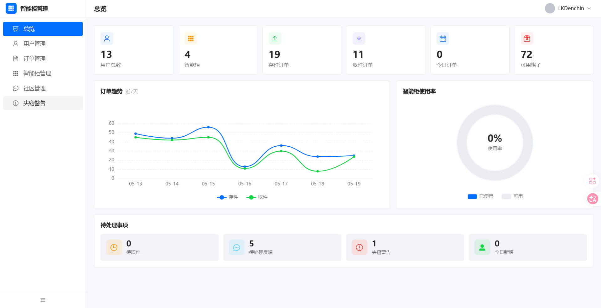

# Easy to Use - Smart Cabinet Management System

English | [中文](README.md)

An IoT-based smart cabinet storage and retrieval system featuring NFC tap-to-pickup, photoelectric sensor theft detection, community interaction, and admin management.

## Screenshots

<table>
  <tr>
    <td align="center"><b>Mobile - Home</b></td>
    <td align="center"><b>Mobile - Cabinet Detail</b></td>
    <td align="center"><b>Mobile - Pickup</b></td>
  </tr>
  <tr>
    <td></td>
    <td></td>
    <td></td>
  </tr>
  <tr>
    <td align="center"><b>Admin - Dashboard</b></td>
    <td align="center"><b>Admin - Overview</b></td>
    <td align="center"><b>Admin - Cabinet Management</b></td>
  </tr>
  <tr>
    <td></td>
    <td></td>
    <td></td>
  </tr>
</table>

## Architecture

```
┌─────────────────────────────┐
│    Mobile App (UniApp)       │  Store/pickup items, view cabinets, community
└─────────────────────────────┘
            │ HTTP/REST API
            ▼
┌─────────────────────────────┐
│    Backend Server (Express)  │  Auth, orders, cabinet status, theft alerts
│    Port: 1145                │
└─────────────────────────────┘
     │                │
     ▼                │ HTTP polling
┌──────────┐          ▼
│  MySQL   │   ┌──────────────────┐
│ Database │   │ ESP32 Cabinet     │
└──────────┘   │ - Photoelectric   │
               │ - NFC Writer      │
               └──────────────────┘

┌─────────────────────────────┐
│   Admin Panel (Vue 3)        │  Dashboard, user/order/alert management
└─────────────────────────────┘
```

## Tech Stack

| Component | Technology | Description |
|-----------|------------|-------------|
| Backend | Node.js + Express | REST API server |
| Database | MySQL / MariaDB | Data persistence |
| Auth | JWT | Stateless token authentication |
| Admin Panel | Vue 3 + Vite + Element Plus | Admin dashboard |
| Visualization | ECharts | Statistical charts |
| Mobile App | UniApp (Vue 3) | User-facing mobile app |
| Hardware | ESP32-C3 | IoT controller |
| Sensors | Photoelectric + PN532 NFC | Item detection & NFC writing |

## Project Structure

```
├── database/               # Backend API service
│   ├── server.js           # Express REST API
│   ├── database.js         # MySQL init & connection pool
│   └── package.json        # Dependencies
│
├── Management-System/      # Admin frontend
│   ├── src/
│   │   ├── views/          # Page components (Dashboard, Users, Orders...)
│   │   ├── router/         # Vue Router config
│   │   ├── stores/         # Pinia state management
│   │   └── utils/          # Request wrapper & utilities
│   ├── vite.config.js      # Vite config (API proxy to port 1145)
│   └── package.json
│
├── uniapp/                 # Mobile UniApp application
│   ├── pages/              # 24 pages (storage, community, customization, themes...)
│   ├── manifest.json       # NFC/camera permission config
│   └── pages.json          # Page routing & tabBar
│
├── ESP32/                  # Hardware terminal programs
│   ├── test/test.ino       # Full cabinet controller (sensor+NFC+status sync)
│   ├── pn532.ino           # NFC writer test program
│   └── light/light.ino     # Photoelectric sensor test program
│
├── screenshots/            # App screenshots
│
└── admin-server.jar        # Backend service jar (optional)
```

## Core Features

### Store Item Flow

1. User selects a cabinet and cell in the app
2. Server generates a pickup code + NFC ID
3. ESP32 fetches the pending phone number and writes it to the NFC tag
4. User places the item, sensor detects it, cell status becomes "occupied"

### Pickup Item Flow

1. User taps NFC tag or enters pickup code
2. Server validates and marks the order as pending pickup
3. ESP32 sensor detects item removal
4. Authorized pickup: cell becomes "available"; Unauthorized removal: theft alert triggered

### Theft Detection

- Photoelectric sensors continuously monitor cell occupancy
- When a cell transitions from "occupied" to empty without a corresponding pickup request, a theft alert is automatically created
- Admin panel can view, confirm, and resolve alerts

### Community

- Four sections: Discussion, Feedback, Activities, Customization
- Supports posting, commenting, and liking

### Cabinet Customization

- Users can submit custom cabinet orders
- Configure cell count, appearance themes, etc.

## Getting Started

### 1. Backend Server

```bash
cd database
npm install
# Configure MySQL connection (edit connection params in database.js)
node server.js
# Server starts at http://localhost:1145
```

### 2. Admin Panel

```bash
cd Management-System
npm install
npm run dev
# Dev server at http://localhost:3000, API requests auto-proxied to backend
```

### 3. Mobile App

Open the `uniapp` directory in HBuilderX, then run on emulator or real device.

### 4. ESP32 Hardware

Open `ESP32/test/test.ino` in Arduino IDE, configure WiFi info and server address, then flash to ESP32-C3.

> Wiring: PN532 NFC module (SDA=GPIO8, SCL=GPIO9), Photoelectric sensor (GPIO2)

## Database Schema

| Table | Description |
|-------|-------------|
| users | User accounts (phone, nickname, avatar, admin flag) |
| cabinets | Cabinet info (GPS, cell status JSON, availability count) |
| orders | Storage/pickup orders (pickup code, NFC ID, recipient info) |
| posts | Community posts (category, status) |
| comments | Post comments |
| post_likes | User likes on posts |
| themes | App and cabinet appearance themes |
| cabinet_orders | Cabinet customization orders |
| theft_warnings | Theft alert records |

## Admin Panel Pages

| Route | Page | Description |
|-------|------|-------------|
| /dashboard | Dashboard | User/cabinet/order stats, trend charts, pending actions |
| /users | User Management | User list, permission management |
| /orders | Order Management | Storage/pickup order viewing & processing |
| /cabinets | Cabinet Management | Cabinet status monitoring, cell reset |
| /posts | Post Management | Community content moderation |
| /warnings | Alert Management | Theft alert processing |

## Mobile App Pages

| Module | Pages |
|--------|-------|
| Storage/Pickup | Store, code pickup, NFC pickup, nearby cabinets, cabinet detail, history |
| Community | Community home, discussion, feedback, activities, post detail |
| Customization | Customization center, new customization, my customizations, customization detail |
| Themes | App themes, cabinet appearance themes |
| Other | Login, settings |

## License

MIT License
